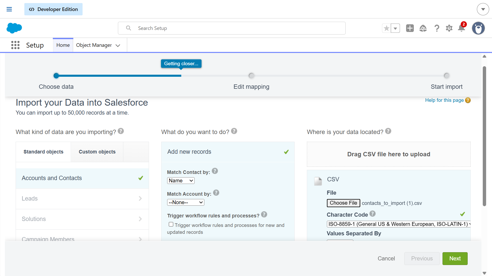
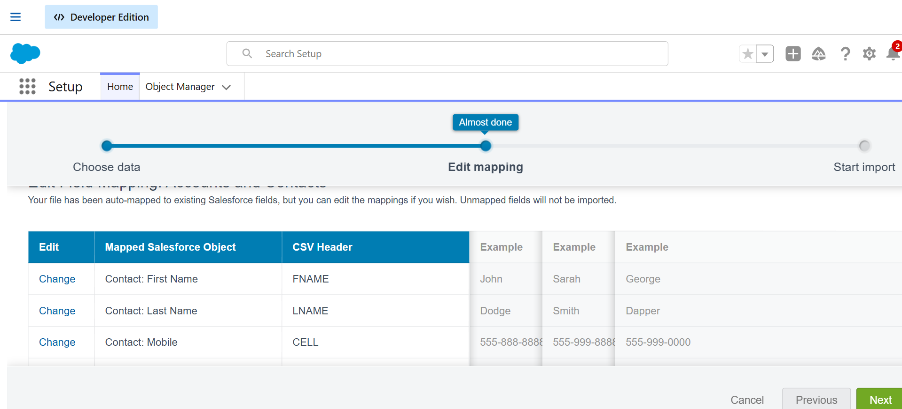
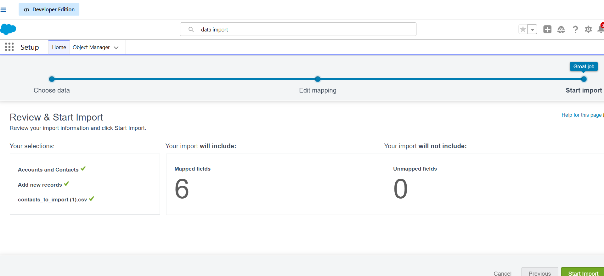

# Salesforce Data Management

This project demonstrates hands-on experience with Salesforce data management tools using a Trailhead Playground.

## Overview

The objective of this project was to learn how Salesforce administrators manage business data through importing, exporting, and maintaining records within the CRM system.

## Key Tasks Completed

• Imported customer data using the Salesforce **Data Import Wizard**  
• Explored **Data Loader** for bulk data operations  
• Verified imported records within Salesforce objects  
• Practiced exporting data for backup and reporting purposes  

## Tools Used

- Salesforce Data Import Wizard
- Salesforce Data Loader
- Salesforce Trailhead Playground

## Screenshots

### Data Import Wizard

### fields mapping

### Data Loader Interface

## Learning Outcomes

Through this project I gained experience with:

- Salesforce data import and export processes
- Managing CRM records
- Bulk data operations in Salesforce
- Maintaining data accuracy in CRM systems
